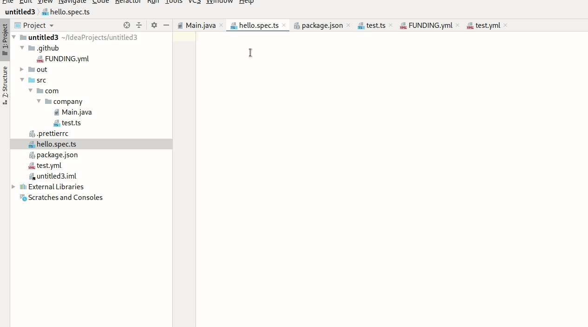
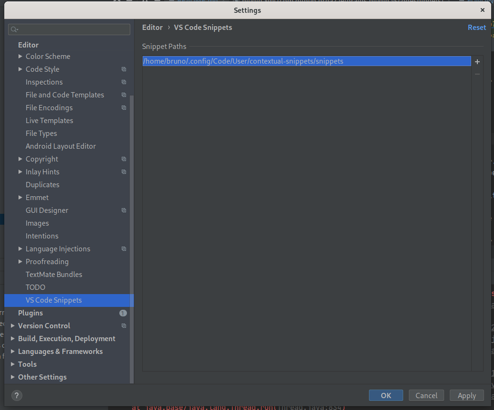

# VS Code Snippets Jetbrains Plugin

> Use your VS Code Snippets directly in Jetbrains IDEs. Compatible with [Contextual Snippets Extenstion](https://github.com/brpaz/vscode-contextual-snips)

## Install

* On Your Jetbrains IDE, go to "Settings" -> "Plugins" and search for "VS Code Snippets". Then press "install" and restart the IDE.

## Usage

⚠️ Snippets not included in the plugin.

First you need to have some snippets in VS Code format.  The structure is the same as any other VS Code snippet with some changes:

* Each snippet must have the "scope" attribute, so the plugin can identify the file type. 

    The scope field is a comma-separated list of the languages that snippet is associated with in VS Code. 
    You can find a basic list of the "language identifiers" [here](https://code.visualstudio.com/docs/languages/identifiers)

* The snippet can contain an additional "context" field, that you can use, to restrict even more when the snippet is displayed. (like files matching a specific pattern).

You can find examples of all of this in [this](https://github.com/brpaz/vscode-snippets) repository.

Then, on your Jetbrains IDE, go to "Settings" -> "Editor" -> "VS Code Snippets" and add the path to the directory containing your snippet files.

 

You can configure multiple paths. After that your snippets should start appearing on the IDE autocomplete.
 
 
## TODO

* Improve handling of variables in templates
* Optionally read the "scope" from the filename so the default VS Code snippets can be used.
* Add more tests

## Show your support

If this project have been useful for you, I would be grateful to have your support.

Give a ⭐️ to the project, and if you feel more generous you can [Sponsor](https://github.com/sponsors/brpaz) me on GitHub.

Alternatively, if you prefer a one time donation, you can:

## Author

👤 **Bruno Paz**

* Github: [@brpaz](https://github.com/brpaz)

## 📝 License

Copyright © 2020 [Bruno Paz](https://github.com/brpaz).

This project is [MIT](https://opensource.org/licenses/MIT) licensed.
